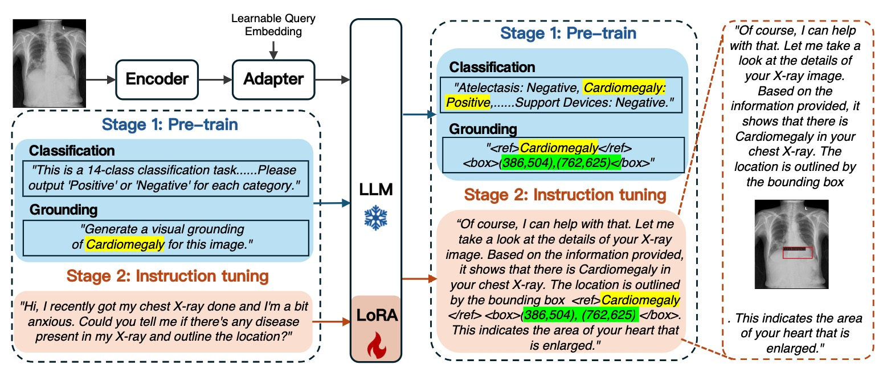
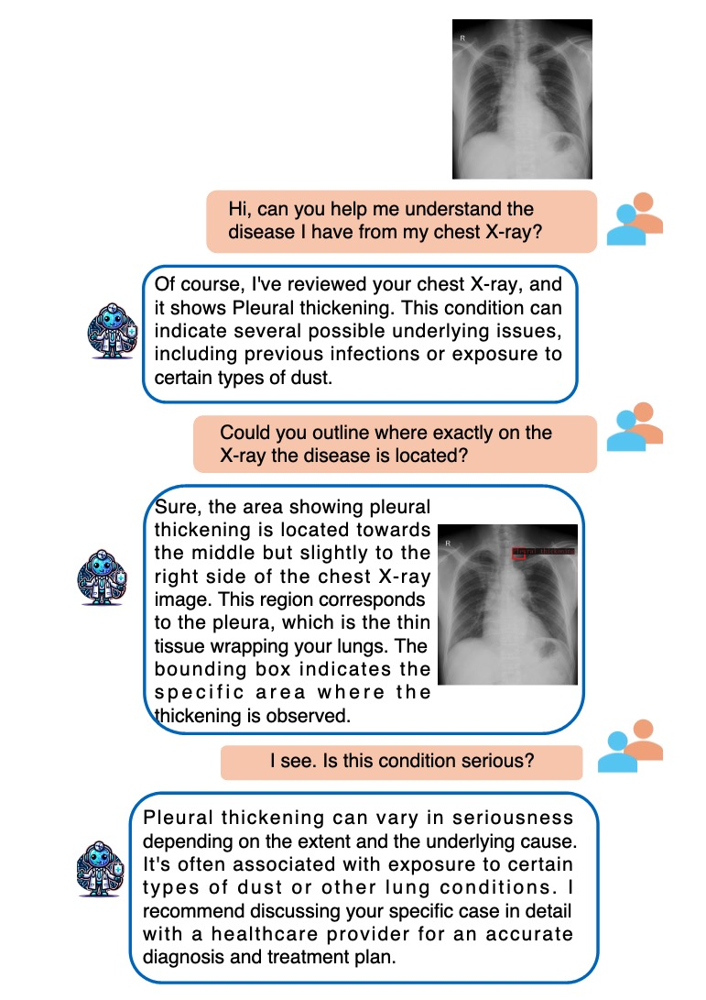

# MedVisioChat: A Multimodal Large Language Model Framework for Interpretable Diagnosis With Visual Grounding in CXRs
##### ISBI 2025

[**MedVisioChat: A Multimodal Large Language Model Framework for Interpretable Diagnosis With Visual Grounding in CXRs**]

[Ling Yang](https://scholar.google.com/citations?user=0x4eX9cAAAAJ&hl=zh-CN),
[Zhanyu Wang](https://scholar.google.com/citations?hl=zh-CN&user=maeFb38AAAAJ),
[Luping Zhou](https://scholar.google.com/citations?user=BThVCu8AAAAJ&hl=zh-CN&oi=ao)<br/>





## Requirements
A suitable [conda](https://conda.io/) environment named `medvisiochat` can be created
and activated with:

```
conda create -n medvisiochat python=3.9
conda activate medvisiochat
conda install pytorch==2.4.1 torchvision torchaudio pytorch-cuda=12.1 -c pytorch -c nvidia
pip install -r requirements.txt
```

For classification task, the json file for MIMIC dataset is [MIMIC](https://drive.google.com/file/d/1N8QDCMFtc7MHWjcQaWsHM9LG2Mgk-a3l/view?usp=drive_link).

For visual grounding task, the json file for VinDr dataset is [VinDr](https://drive.google.com/file/d/1_N7AEYrm0aFpWcE1OMIOR1q8a4WRsila/view?usp=drive_link).

To train the medvisiochat, run
```
python train.py
```

To inference the medvisiochat, run
```
python inference.py
```
